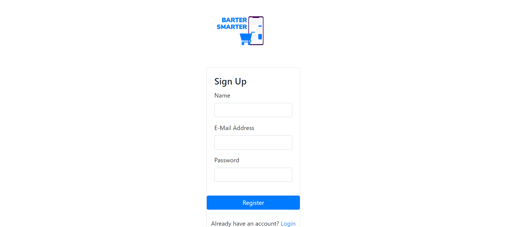

# BarterSmarter
A convienient marketplace app that allows you to add unwanted items and price match them with other items added to the website and initiate a trade instead of a purchase.

## Description
This app allows users to add items to a database and be matched with other items in the database in order to initiate a trade instead of a purchase. Items can be saved to a profile and found at random or searched specifically by category.

## Installation
Run npm i in Node to install the app dependencies.

## Preview!

## Credits
Marianne Seiwert
Han Zhang
Christian Fellwock

## License 

MIT License

Copyright (c) [2022] [Christian Fellwock]

Permission is hereby granted, free of charge, to any person obtaining a copy
of this software and associated documentation files (the "Software"), to deal
in the Software without restriction, including without limitation the rights
to use, copy, modify, merge, publish, distribute, sublicense, and/or sell
copies of the Software, and to permit persons to whom the Software is
furnished to do so, subject to the following conditions:

The above copyright notice and this permission notice shall be included in all
copies or substantial portions of the Software.

THE SOFTWARE IS PROVIDED "AS IS", WITHOUT WARRANTY OF ANY KIND, EXPRESS OR
IMPLIED, INCLUDING BUT NOT LIMITED TO THE WARRANTIES OF MERCHANTABILITY,
FITNESS FOR A PARTICULAR PURPOSE AND NONINFRINGEMENT. IN NO EVENT SHALL THE
AUTHORS OR COPYRIGHT HOLDERS BE LIABLE FOR ANY CLAIM, DAMAGES OR OTHER
LIABILITY, WHETHER IN AN ACTION OF CONTRACT, TORT OR OTHERWISE, ARISING FROM,
OUT OF OR IN CONNECTION WITH THE SOFTWARE OR THE USE OR OTHER DEALINGS IN THE
SOFTWARE.
